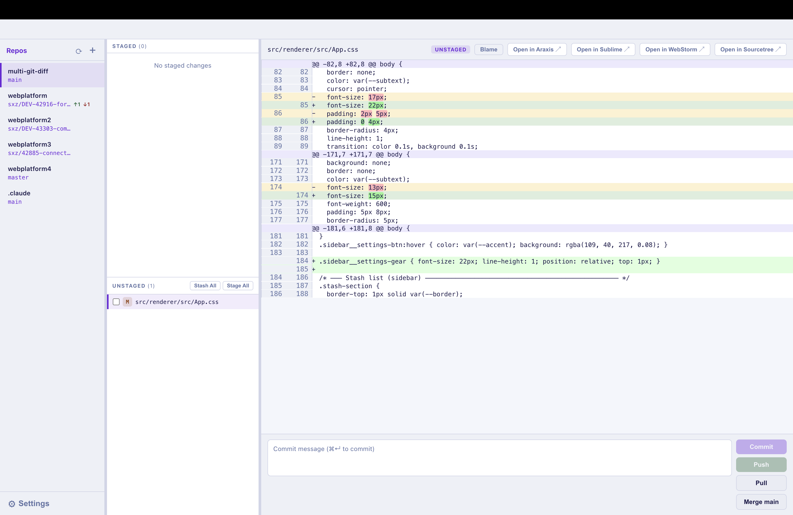
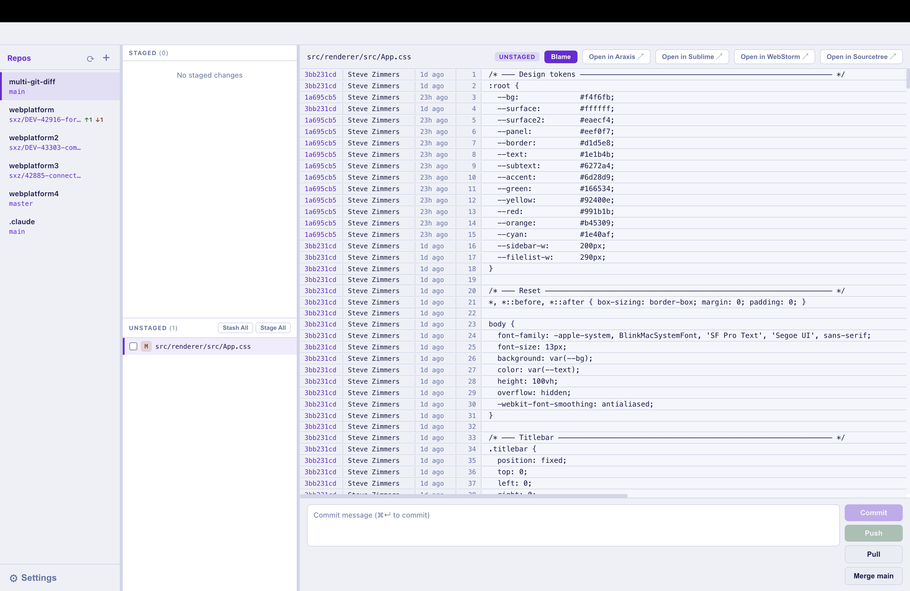
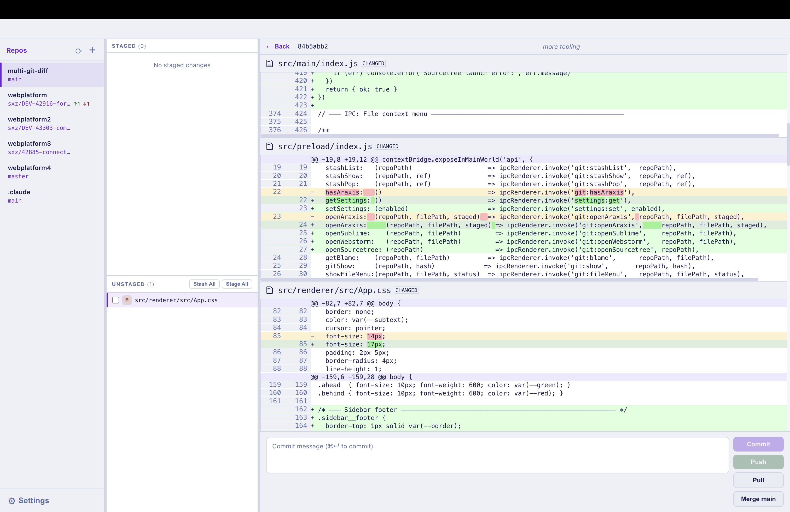
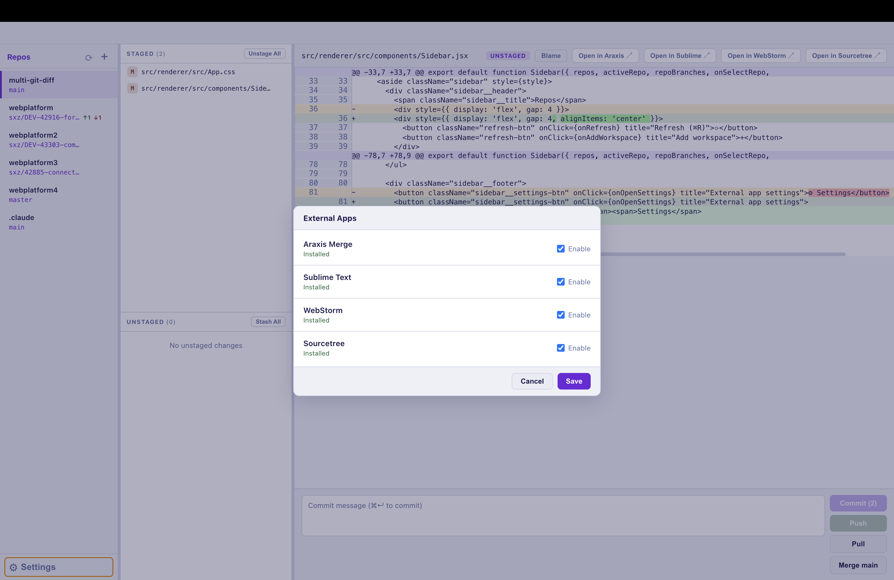

# multi-git-diff

A macOS desktop app for reviewing and committing git changes across multiple repositories.

## Features

- **Multi-repo sidebar** — manage any number of repos; switch with ⌘1–9; drag to reorder
- **Branch & sync status** — shows current branch, ahead (↑) and behind (↓) commit counts
- **Staged / Unstaged file lists** — stage, unstage, or bulk stage/unstage with one click
- **File status badges** — color-coded M/A/D/R/C/U/? indicators for every file
- **Diff viewer** — unified line-by-line diff with syntax highlighting (JSON supported)
- **Git blame** — toggle per-line authorship (author, hash, relative date)
- **Commit view** — click any blame hash to see the full commit diff; click hash to copy
- **Stash support** — stash all or selected files; view stash diffs; pop from sidebar
- **Commit & Push** — separate commit, push, pull, and merge-main actions with live counts
- **Araxis Merge integration** — open any diff in Araxis for a full side-by-side view
- **File context menu** — right-click to add to .gitignore, delete untracked files, or revert changes
- **Auto-advance** — after staging a file, the next unstaged file is auto-selected
- **Resizable columns** — drag dividers between sidebar, file list, and diff pane
- **Live updates** — file watcher auto-refreshes status when the git index changes

## Screenshots

| | |
|---|---|
|  |  |
| See unstaged changes | See blame |
|  |  |
| See commit history | Configure external tools |

## Tech Stack

- [Electron](https://electronjs.org) — desktop shell
- [React 18](https://react.dev) — renderer UI
- [electron-vite](https://electron-vite.github.io) — build tooling
- [simple-git](https://github.com/steveukx/git-js) — git operations
- [diff2html](https://diff2html.xyz) — diff rendering
- [highlight.js](https://highlightjs.org) — syntax highlighting
- [chokidar](https://github.com/paulmillr/chokidar) — file watching

## Prerequisites

- Node.js 18+
- macOS (uses `hiddenInset` titlebar; Araxis Merge optional)

## Setup

```bash
npm install
```

## Development

```bash
npm run dev
```

## Build

```bash
npm run build
```

## Keyboard Shortcuts

| Shortcut | Action |
|---|---|
| ⌘1–9 | Switch to repo 1–9 |
| ⌘R | Refresh active repo status |
| ⌘↵ | Commit staged changes (from commit message box) |

## Workspace Storage

Repositories are persisted to:

```
~/Library/Application Support/multi-git-diff/workspaces.json
```
